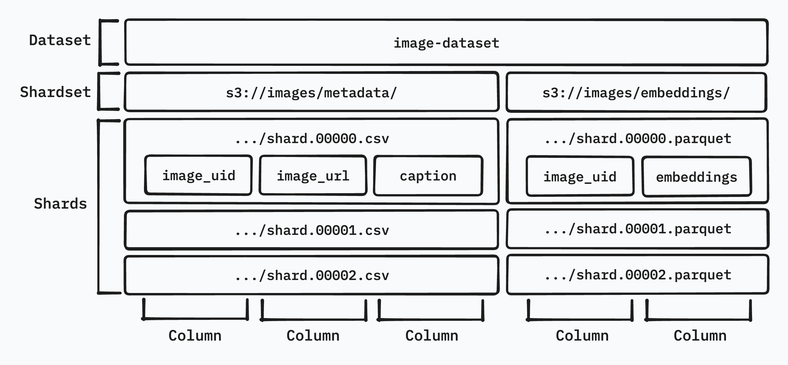
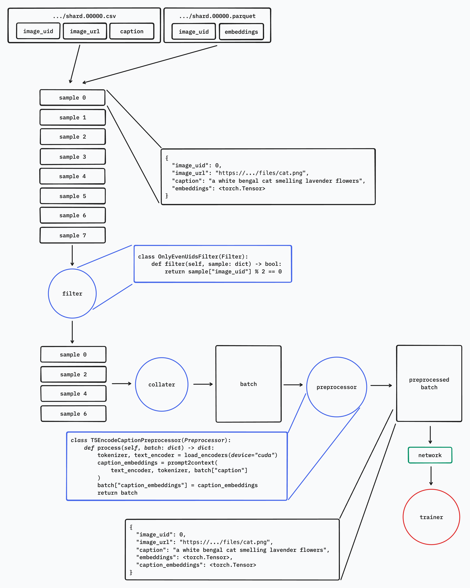
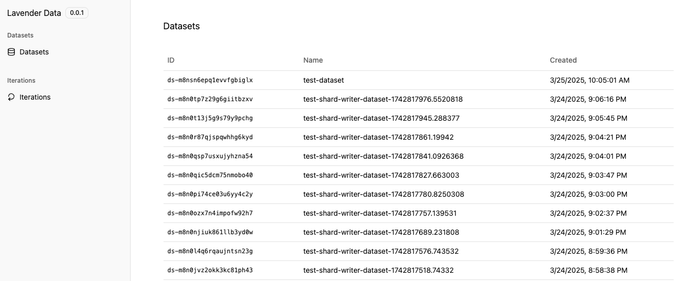
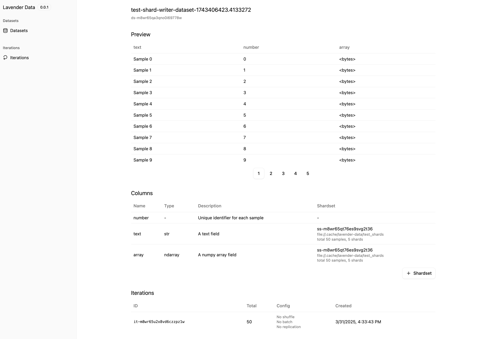
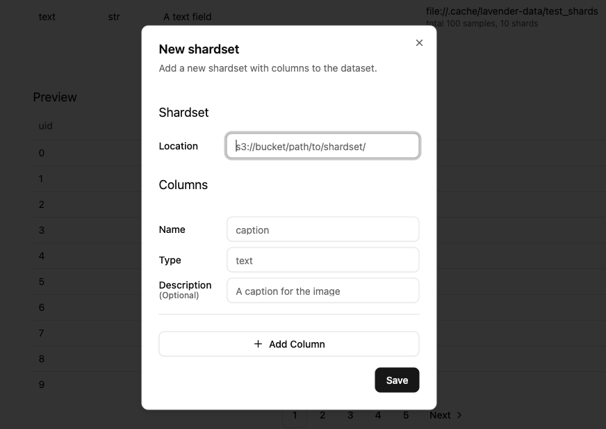
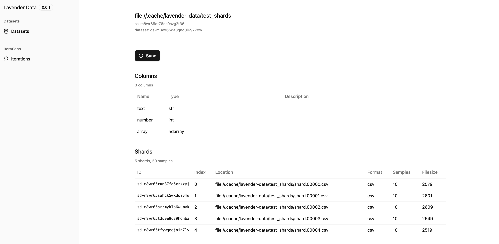
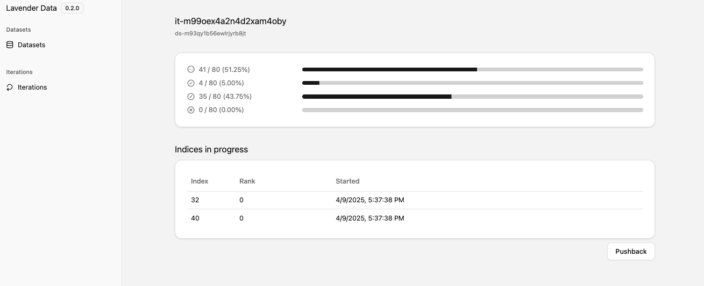

# Lavender Data

Lavender Data: Streamline Your Pipeline, Offload Your GPUs, and Transform Your ML Workflow from Fragmented Files to Flowing Features

## Key Features

### Streaming

- **Remote Preprocessing**: Preprocess data on a remote server to offload your GPUs while training
- **Zero Disk Usage**: All data is loaded directly into memory through a network
- **Cloud Storage Support**: Load data from cloud storages

### Joinable Dataset

- **Efficient Feature Addition**: Add new features to your dataset without rewriting your data
- **Efficient Data Loading**: Selectively load only the features you need for your task

### Flexible Iteration

- **Online Filtering**: Filter data on the fly using custom filters
- **Shuffle**: Shuffle data across shards
- **Resumable**: Resume an iteration from where you left off
- **Fault Tolerant**: Retry or skip failed samples without any concerns

### Web UI

- **Datasets**: Create, manage and preview your datasets. Sync cloud storage to the dataset.
- **Iterations**: Track the realtime progress of your iterations

### Customizable

- **Custom Modules**: Easily define custom filters, collaters, and preprocessors

## Key Concepts

### Dataset Layers



- **Dataset**: The top-level container for your data, identified by a unique name
- **Shardset**: A collection of data shards within a dataset, typically representing a group of related columns
- **Shard**: A single file that contains a subset of the data.

### Pipeline Overview



- **Filters**: Determine which samples to include/exclude during iteration
- **Collaters**: Control how individual samples are combined into batches
- **Preprocessors**: Transform batches before they're returned to your application

## Basic Usage

### Installation

`lavender-data` is available on pip.

```bash
pip install lavender-data
```

Use below command to start the server.

```bash
python3 -m lavender_data.server --host 0.0.0.0 --port 8000 --ui-port 3000 --reload
```

### Custom Modules

Create a module directory and set the environment variable:

```bash
export LAVENDER_DATA_MODULES_DIR=./modules
```

Define custom components:

```python
# modules/custom_filter.py
from lavender_data.server import Filter

class UidModFilter(Filter, name="uid_mod"):
    def filter(self, sample: dict, *, mod: int = 2) -> bool:
        return sample["uid"] % self.mod == 0
```

Please restart the server after adding or modifying the custom modules.

### Web UI

After starting the server, dashboard is be available at [http://localhost:3000](http://localhost:3000)
Go to the datasets page and you should see list of your datasets.



Click on a dataset id to view details including the shardsets, preview of the data and the iterations.



Press `Shardset` button to add a new shardset.
If you have at least one shard in the shardset location (e.g. s3 path, local directory, etc.),
the columns will be inferred from the shard automatically.



Click on a shardset id to view details.
The shard files under the shardset location will be synced as shards of the shardset
once you press the `Sync` button.
This is useful when you added more shard files to the locaion.



Click on an iteration id to view the realtime progress.
There's 4 progress bars:

1. **Current**: The index of the sample currently being processed
2. **Completed**: The number of samples that have been completed
3. **Filtered**: The number of samples that have been filtered out
4. **Failed**: The number of samples that have failed to process

You can also see the indices which are currently being processed and which rank is processing it.
Press `Pushback` to put all in-progress-indices back into the queue.
This is useful when you want to pause the iteration and resume from the same place.



### Initializing the Client

To access dataset served from the `lavender-data` server, please use `lavender_data.client` module.

```python
from lavender_data.client import api as lavender

lavender.init(api_url="http://localhost:8000")
```

### Iterating over dataset

```python
from lavender_data.client import Iteration

dataset = lavender.get_dataset(name="my-dataset")
shardset = dataset.shardsets[0] # Select the shardset you want to iterate over

iteration = Iteration.from_dataset(
    dataset_id=dataset.id,
    shardsets=[shardset.id],
    batch_size=10,
    shuffle=True,
)

for batch in iteration:
    print(batch)

```

### Iterating over dataset (as a torch data loader)

```python
dataloader = Iteration.from_dataset(
    dataset_id=dataset.id,
    shardsets=[shardset.id],
    batch_size=10,
    shuffle=True,
).to_torch_dataloader(
    prefetch_factor=4,
    pin_memory=True,
    pin_memory_device="cuda:0",
)

if __name__ == "__main__":
    for batch in dataloader:
        print(batch)
```

## Managing datasets programatically

You can manage datasets and shardsets also with `lavender_data.client` instead of using the dashboard,
if you want to access them programatically.

### Creating datasets and shardsets

```python
# Create a dataset
from lavender_data.client import api as lavender

dataset = lavender.create_dataset(name="my-dataset", uid_column_name="uid")

# Add a shardset with columns
shardset = lavender.create_shardset(
    dataset_id=dataset.id,
    location="file://.cache/lavender-data/my_shards",
    columns=[
        lavender.DatasetColumnOptions(
            name="uid",
            description="Unique identifier",
            type_="int",
        ),
        lavender.DatasetColumnOptions(
            name="text",
            description="Text content",
            type_="str",
        ),
    ],
)
```

### Writing data (adding shards)

```python
# Write data to the shardset
from lavender_data.shard import Writer

writer = Writer.get(
    format="csv",
    dataset_id=dataset.id,
    shardset_id=shardset.id,
)

# Write samples
samples = [
    {"uid": i, "text": f"Sample {i}"} for i in range(100)
]
writer.write(samples=samples, shard_index=0)
```

Refer to the [example](https://github.com/fal-ai/lavender-data/tree/main/examples/quick-start/quick-start.ipynb) for more details.
